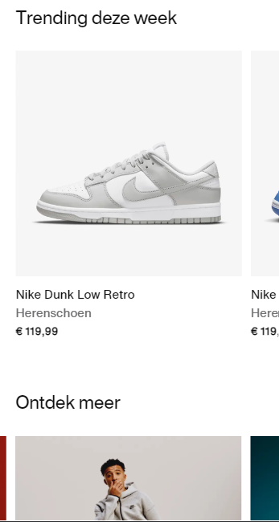
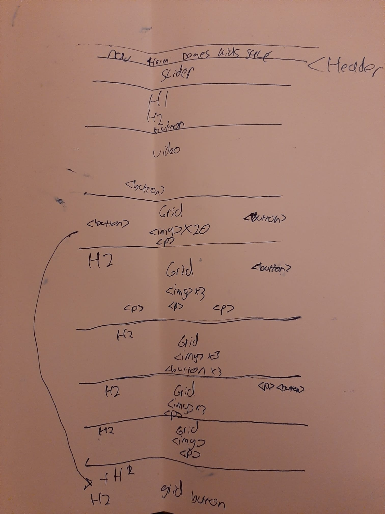
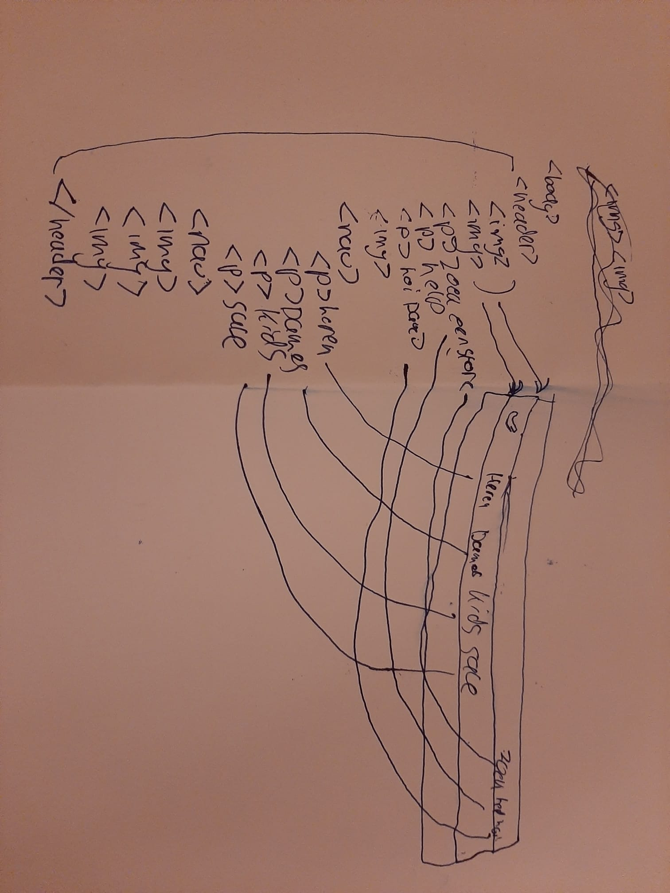
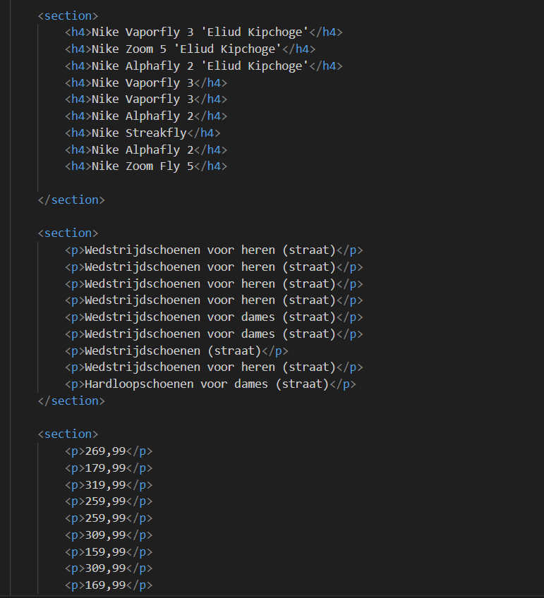
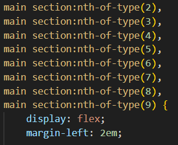
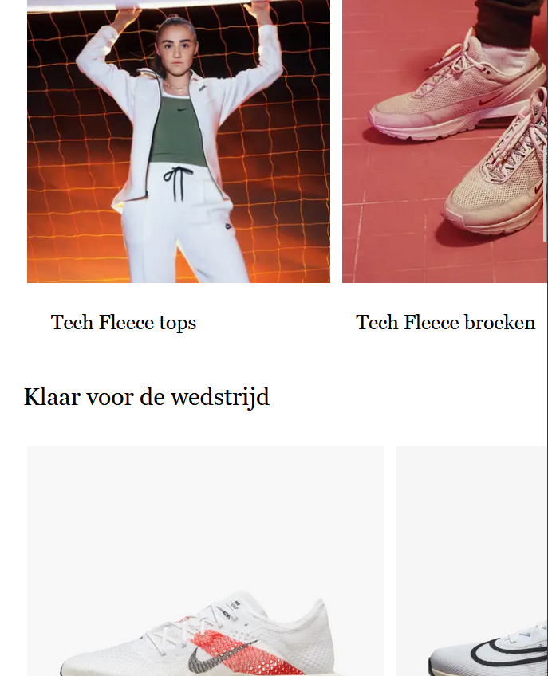
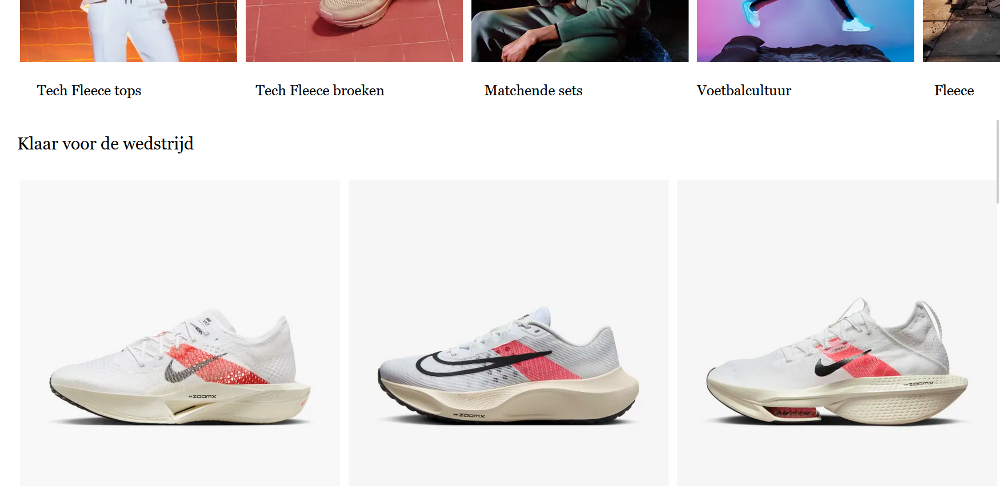

# Procesverslag
Markdown is een simpele manier om HTML te schrijven.  
Markdown cheat cheet: [Hulp bij het schrijven van Markdown](https://github.com/adam-p/markdown-here/wiki/Markdown-Cheatsheet).

Nb. De standaardstructuur en de spartaanse opmaak van de README.md zijn helemaal prima. Het gaat om de inhoud van je procesverslag. Besteedt de tijd voor pracht en praal aan je website.

Nb. Door *open* toe te voegen aan een *details* element kun je deze standaard open zetten. Fijn om dat steeds voor de relevante stuk(ken) te doen.

## Jij

  
uitwerken voor kick-off werkgroep

  ### Auteur:
  Dave van Stigt

  #### Je startniveau:
  Blauw

  #### Je focus:
  Responsive
 

## Je website

  
uitwerken voor kick-off werkgroep

  ### Je opdracht:
  https://davevstigt.github.io/frontend/

  #### Screenshot(s) van de eerste pagina (small screen): 
  Nike
  

  #### Screenshot(s) van de tweede pagina (small screen):
  hier de naam van de pagina  
  
 

## Toegankelijkheidstest 1/2 (week 1)

  
uitwerken na test in 2e werkgroep

  ### Bevindingen
  Lijst met je bevindingen die in de test naar voren kwamen:

  Ik ben erachter gekomen dat Nike best wel toegankelijk is met een screenreader, ook heb ik geleerd om een screenreader te bedienen, en hoe het werkt. Hierdoor kan ik mij beter inleven met iemand met een beperking als ik aan het designen ben.

  Op content gebied is Nike erg toegankelijk.
  Ook op het gebeid global code scoort Nike goed, allen zaten er errors in de HTML.
  
  Wat ik vrij opvallend vond is dat Nike op video gebied op elk punt niet voldoed aan de checklist.

## Breakdownschets (week 1)

  
uitwerken na afloop 3e werkgroep

  ### de hele pagina: 
  

  ### dynamisch deel (bijv menu): 
  

## Voortgang 1 (week 2)

  
uitwerken voor 1e voortgang

  ### Stand van zaken
  Ik ben op dit moment bezig met mijn html compleet maken, daarna ga ik pas over op css. Het is veel werk dat erg op hetzelfde lijkt, daarom kan het soms een beetje saai zijn. Ook kost het veel tijd om alle afbeeldingen te verzamelen, en te ordenen in mijn images map.

  

  ### Agenda voor meeting
  samen met je groepje opstellen

  Ik wil vooral feedback krijgen op of mijn html semantisch correct is. Ook heb ik vragen over wanneer ik een div of een section moet gebruiken, en wanneer een class en wanneer een nth-of-type.

  ### Verslag van meeting
  hier na afloop snel de uitkomsten van de meeting vastleggen

  - Ik kreeg als feedback dat ik goed op weg was, en dat mijn code er netjes uitzach. 
  - Ik kreeg ook het advies om zo min mogelijk div's te gebruiken, en ook zo min mogelijk classes, alleen als het echt moet.
  - Ik kreeg ook de tip om in plaats van een grid een lijst te gebruiken voor het naast elkaar zetten avn de images.
  

## Voortgang 2 (week 3)

  
uitwerken voor 2e voortgang

  ### Stand van zaken
  Ik ben bijna klaar met mijn eerste pagina, en merk dat ik steeds beter wordt met coderen. Ook heb ik geprobeerd om bijna geen classes te gebruiken, en merk nu dat het een grote uitdaging is om te coderen met ontelbaar veel nth-of-type en nth-childs.

  

  ### Agenda voor meeting
  samen met je groepje opstellen

  Ik wil feedback krijgen op mijn css een html code, en hoe het er visueel uitziet. Ik wil ook hulp met mijn pagina niet horizontaal scrollbaar maken.

  ### Verslag van meeting
  
  Ik kreeg als feedback dat mijn code er netjes uitziet, maar ik wel mag gaan doorwerken, omdat ik niet super ver ben.
  Ik weet nu dat ik doormiddel van overvlow-x mijn pagina niet horizontaal scrollbaar maak.
- ...

## Toegankelijkheidstest 2/2 (week 4)

  
uitwerken na test in 9e werkgroep

  ### Bevindingen
 Mijn site komt vrij goed uit de screen reader test.
 Veel komt overeen met de test van Nike, omdat ik die site letterlijk namaak. 
 Mijn code is wel vaak wat overzictelijker, maar dat komt ook omdat ik lang niet zo veel code heb als de Nike website.
 Het nadeel daarvan is dat ik op sommige onderdelen, zoals bijvoorbeeld responsiveness niet goed score, omdat ik nog niet zo ver ben daarmee.

 
 
  
 
 
 
  
 
 
 

## Voortgang 3 (week 4)

  
uitwerken voor 3e voortgang

  ### Stand van zaken
  Ik ben nu bezig met mijn tweede pagina, en ga bijna beginnen met het responsive maken, mijn tweede pagina is vrij lang, dus het kostte best veel tijd om deze volledig te coderen. Het ging me wel makkelijker af dan de eerste pagina, mede omdat ik steeds beter er in word, naamrate ik steeds meer er mee bezig ben. Ik merk dat ik vooral in het ordenenen en aanroepen avn content stappen maak.

  ### Agenda voor meeting
  
  Ik was niet aanwezig bij de les, dus heb geen feedback kunnen ontvangen.

## Eindgesprek (week 5)

  
uitwerken voor eindgesprek

  ### Je uitkomst - karakteristiek screenshots:
  

  ### Dit ging goed/Heb ik geleerd: 
  Ik heb gemerkt dat ik vooral in het schrijven van html en css grote stappen heb gezet. Ik ben ook beter gaan bergrijpen hoe de codeertaal in elkaar zit. Vooral met het verdelen van delen en het aanroepen en bewerken van onderdelen ging gedurende mijn porces steeds beter. Aan het begin gebruikte ik veel classes, en ik heb gemerkt gedurende ik bezig was, deze eigelijk niet nodig zijn.

  Ook heb ik geleerd hoe je een pagina responsive kan maken, ik had hier nog geen ervaring mee. Dit is mij dels gelukt. 

  

  ### Dit was lastig/Is niet gelukt:
  Ik heb een grote fout gemaakt, door bijna alleen maar nth-of-types en nth-childs te gebruiken. Hierdoor kost het superveel tijd als je achteraf een element wilt toevoegen, omdat je dan bijna je hele code moet aanpassen, en met meer dan 2000 css regels, is dit bijna niet te doen. Hierdoor ben ik in tijdsnood gekomen en heb ik de opdracht niet op tijd af kunnen hebben. 

  Ook het responsive maken van voor headings en 
 elementen ging mij slecht af. Ik vond maar geen manier om de marges net als bij de afbeeldingen, geleidelijk groter te amken, naarmate de viewport wordt uitgezoomd.
  Ik moest er dus voor kiezen om om de zoveel pixels mediaqueries te gebruiken, en hier al mijn 
 en <h2> en <h3> elementen te verplaatsen. Dit kosste ook veel tijd en css-regels.

  

## Bronnenlijst

  
continu bijhouden terwijl je werkt

  Nb. Wees specifiek ('css-tricks' als bron is bijv. niet specifiek genoeg). 
  Nb. ChatGpT en andere AI horen er ook bij.
  Nb. Vermeld de bronnen ook in je code.

  1. https://chat.openai.com
  2. Slaying The Dragon. (2023, 12 april). Master media queries and responsive CSS web design like a chameleon! [Video]. YouTube. https://www.youtube.com/watch?v=K24lUqcT0Ms
  3. Kevin Powell. (2016, 21 december). Tutorial: Learn how to use CSS media queries in less than 5 minutes [Video]. YouTube. https://www.youtube.com/watch?v=2KL-z9A56SQ
  4. CSS White-space property. (z.d.). https://www.w3schools.com/cssref/pr_text_white-space.php
  5. CSS layout - the display property. (z.d.). https://www.w3schools.com/css/css_display_visibility.asp
  6. CSS Values and Units - Learn Web Development | MDN. (2023, 6 september). https://developer.mozilla.org/en-US/docs/Learn/CSS/Building_blocks/Values_and_units
  7. :Root - CSS: Cascading Style Sheets | MDN. (2023, 21 februari). https://developer.mozilla.org/en-US/docs/Web/CSS/:root
  8. Object-Fit - CSS: Cascading Style Sheets | MDN. (2023, 7 juli). https://developer.mozilla.org/en-US/docs/Web/CSS/object-fit?retiredLocale=nl

